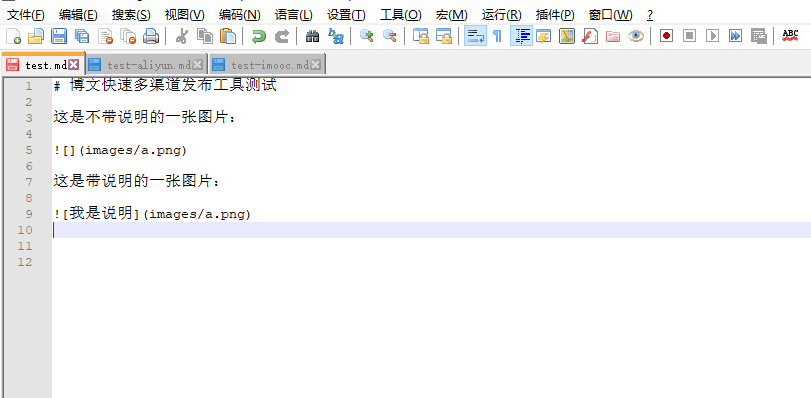
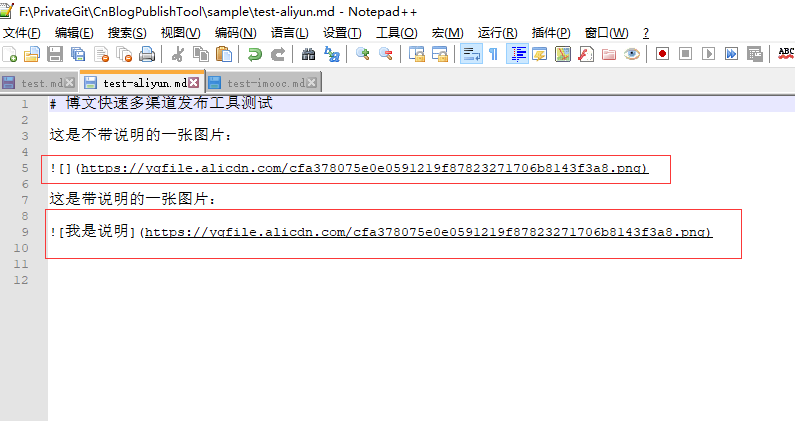
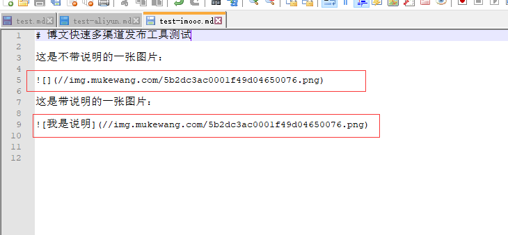
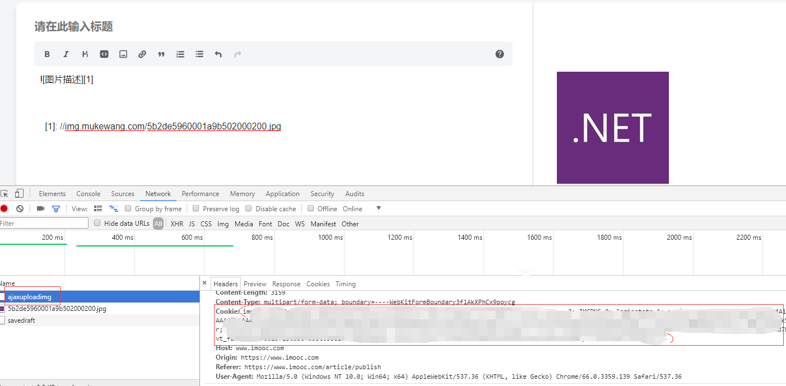
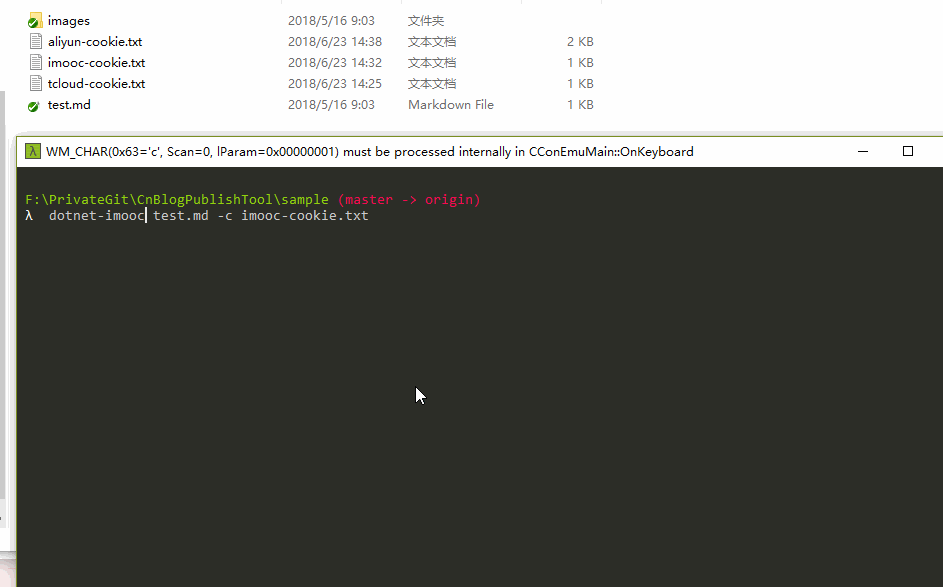
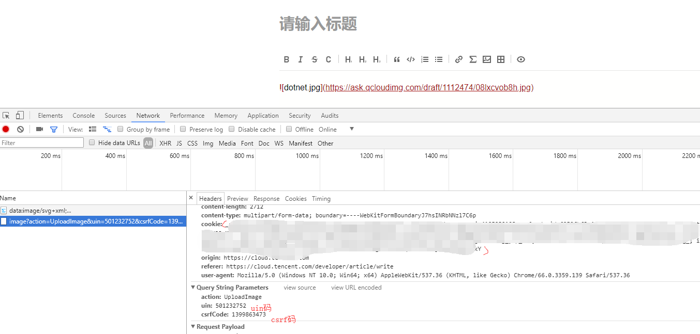
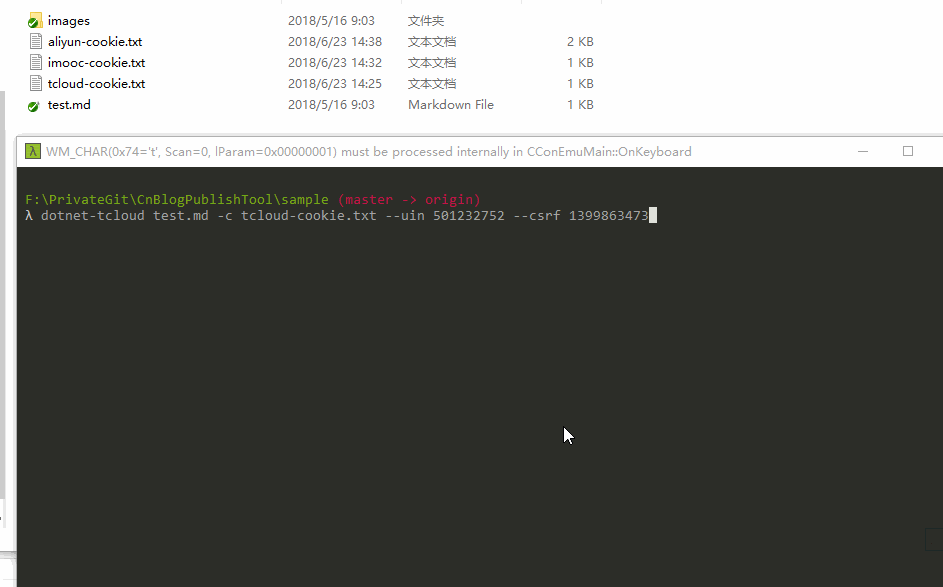

# BlogTools

博文快速多渠道发布工具包，支持博客园、阿里云栖社区、腾讯云+社区、慕课网手记 4种渠道。

## 二.作用

>本工具只适用于用Markdown写博客或者文章的人群，如果你还不会请花一个小时的时间去熟悉，你就能感受到Markdown给你带来的好处了。

使用本工具前，建议先阅读这篇文章：《[如何高效的编写与同步博客](https://www.cnblogs.com/stulzq/p/9043632.html)》

图片的链接改为对应渠道图片的链接，那么我们发布也只用复制粘贴即可，瞬间完成十分高效。
我们使用Markdown编写博文，总免不了文章中出现图片，这里的图片有两种类型，一种是放在互联网上的，一种是放在本地的。如果我引用的是互联网上的图片（如 https://xxx.com/xxx.png ），我们在各个渠道发布的时候只需要复制粘贴即可，但是这带来一个问题，如果我们引用图片的网站如果关闭了外链，那我们所发的文章的图片都将会失效，影响文章的质量。如果我们的图片放在本地，那么我们在多个渠道发布的时候，又需要在每个渠道一张张上传图片，岂不是太麻烦，太耗时间了。如果有一个工具能自动解析博文中引用的图片，然后自动上传到对应的渠道，并且把我们博文中引用本地图片的链接改为对应渠道图片的链接，那么我们发布也只用复制粘贴即可，瞬间完成十分高效。

BlogTools工具包就是为了解决上述问题，它会解析Markdown文件中的图片，然后上传到对于渠道，并且替换本地链接，下面用几张图来表示：

1.原文：



2.转换为 阿里云栖社区 渠道



3.转换为 慕课网手记 渠道



主要就是减少你到每个渠道去上传文件的操作。你只需复制转换以后的内容，粘贴到对于的渠道即可完成发布。

## 二.各个渠道工具包

工具名  | 说明 | 版本号 
-------- | :------------  | :------------ 
dotnet-aliyun | 阿里云栖社区  |  [](https://www.nuget.org/packages/dotnet-aliyun/)
dotnet-imooc  | 慕课网手记  | [](https://www.nuget.org/packages/dotnet-imooc/) 
dotnet-tcloud  | 腾讯云+社区  | [](https://www.nuget.org/packages/dotnet-tcloud/) 
dotnet-cnblog  | 当面付SDK的ASP.NET Core组件，为了能更好配合ASP.NET Core 使用  | [](https://www.nuget.org/packages/dotnet-cnblog/) 

## 三.安装

使用本系列工具需要你的pc具备 .NET Core 2.1版本 SDK 环境或者更高版本。且完全支持跨平台，你可以在.NET Core 支持的任意Linux发行版、Windows、MAC OSX上使用。

.NET Core SDK 下载地址：https://www.microsoft.com/net/learn/get-started/windows

### 1.阿里云栖社区 工具安装

打开命令提示符（cmd），输入下面的命令进行安装

````shell
dotnet tool install -g dotnet-aliyun
````


### 2.慕课网手记 工具安装

打开命令提示符（cmd），输入下面的命令进行安装

````shell
dotnet tool install -g dotnet-imooc
````


### 3.腾讯云+社区 工具安装

打开命令提示符（cmd），输入下面的命令进行安装

````shell
dotnet tool install -g dotnet-tcloud
````


### 4.博客园 工具安装

打开命令提示符（cmd），输入下面的命令进行安装

````shell
dotnet tool install -g dotnet-cnblog
````


## 四.卸载

卸载工具的命令格式为：

````shell
dotnet tool uninstall -g <工具名称>
````

## 五.使用

本工具主要面向写**技术博客**的人员，所以工具在某些细节的地方并未做处理，比如“登录”。需要用户自己登录以后，提取Cookie给工具使用。

### 1.阿里云栖社区 工具的使用

#### (1).使用

获取工具的帮助说明，请执行下面的命令，对每个参数都有说明：

````shell
dotnet-aliyun -h
````
输出：
````
Usage: dotnet-aliyun [arguments] [options]

Arguments:
  MarkdownFilePath  Required.Your mrkdown File Path.

Options:
  -h|--help         Show help information
  -c|--cookie       Required.Cookie file path.
````

使用命令的格式为：

````shell
dotnet-aliyun <Markdown文件路径> -c <cookie文件路径>
````

例如:

````shell
dotnet-aliyun c:\blog\test.md -c c:\blog\cookies\aliyun-cookie.txt
````
#### (2).Cookie 的提取

a.使用浏览器登录并访问博客编写的页面：https://yq.aliyun.com/articles/new

b.打开浏览器的开发者工具并选择 network 选项卡，准备查看上传图片的交互请求。

c.随便选择一张图片上传

d.查看这次请求里的Cookie，并保存到文本文件中

提取Cookie演示：


>只复制图中的括号中的数据

操作演示：


### 2.慕课网手记 工具的使用

#### (1).使用

获取工具的帮助说明，请执行下面的命令，对每个参数都有说明：

````shell
dotnet-imooc -h
````
输出：
````
Usage: dotnet-imooc [arguments] [options]

Arguments:
  MarkdownFilePath  Required.Your mrkdown File Path.

Options:
  -h|--help         Show help information
  -c|--cookie       Required.Cookie file path.
````

使用命令的格式为：

````shell
dotnet-imooc <Markdown文件路径> -c <cookie文件路径>
````

例如:

````shell
dotnet-imooc c:\blog\test.md -c c:\blog\cookies\imooc-cookie.txt
````
#### (2).Cookie 的提取

a.使用浏览器登录并访问博客编写的页面：https://www.imooc.com/article/publish

b.打开浏览器的开发者工具并选择 network 选项卡，准备查看上传图片的交互请求。

c.随便选择一张图片上传

d.查看这次请求里的Cookie，并保存到文本文件中

提取Cookie演示：



>只复制图中的括号中的数据

操作演示：



### 3.腾讯云+社区 工具的使用

#### (1).使用

获取工具的帮助说明，请执行下面的命令，对每个参数都有说明：

````shell
dotnet-tcloud -h
````
输出：
````

Usage: dotnet-tcloud [arguments] [options]

Arguments:
  MarkdownFilePath  Required.Your mrkdown File Path.

Options:
  -h|--help         Show help information
  -c|--cookie       Required.Cookie file path.
  --uin             Required.
  --csrf            Required.
````

使用命令的格式为：

````shell
dotnet-imooc <Markdown文件路径> -c <cookie文件路径> --uin <uin码> --csrf <跨域验证码>
````

例如:

````shell
dotnet-tcloud c:\blog\test.md -c c:\blog\cookies\imooc-cookie.txt --uin 55566677 --csrf 7788991
````
#### (2).Cookie 的提取

a.使用浏览器登录并访问博客编写的页面：https://cloud.tencent.com/developer/article/write

b.打开浏览器的开发者工具并选择 network 选项卡，准备查看上传图片的交互请求。

c.随便选择一张图片上传

d.查看这次请求里的Cookie，并保存到文本文件中

e.根据本次上传图片请求url中的参数提取uin码和csrf码

提取Cookie演示：



>只复制图中的括号中的数据

操作演示：



### 4.博客园 工具的使用

因博客园工具本系列最早的一个工具，使用方法最简单便捷，无需自己提取cookie，是单独开发。详细的使用说明请移步查看：https://github.com/stulzq/CnBlogPublishTool

## 六.隐私

本工具完全开源，不会收集你的任意数据。

## 七.贡献代码

如果你有问题或者建议，欢迎提交 pull request 贡献代码。


